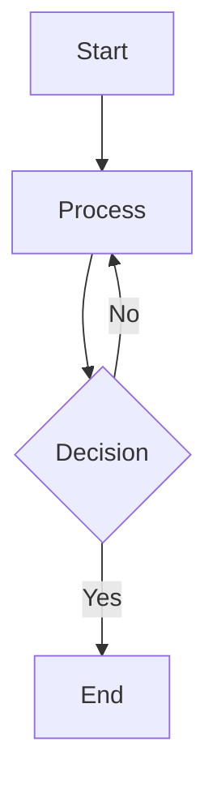

# Features Overview

## ✨ Core Features

### 1. Wikilink Support
- **File Links**: `[[note]]` or `[[folder/note]]`
- **Directory Links**: `[[/folder/]]` - shows directories as nodes in graph
- **Aliases**: `[[note|Custom Display Text]]`
- **Auto-completion**: Links are clickable in both editor and preview

### 2. Graph Visualization
- **Interactive Force Graph**: D3-based 2D visualization
- **Node Types**:
  - Files: Gray circles
  - Directories: Blue squares (#284CAC)
- **Features**:
  - Click to navigate
  - Hover for preview
  - Zoom and pan
  - Auto-layout with force simulation
  - Backlinks tracking

### 3. Rich Markdown Editor
- **CodeMirror 6**: Fast, extensible editor
- **Syntax Highlighting**: Markdown, code blocks
- **Live Preview**: Split-pane markdown rendering
- **Auto-save**: Changes saved automatically after 1 second

### 4. LaTeX Mathematics
- **Inline Math**: `$E = mc^2$`
- **Display Math**:
  ```
  $$
  \int_{-\infty}^{\infty} e^{-x^2} dx = \sqrt{\pi}
  $$
  ```
- **Powered by KaTeX**: Fast, beautiful rendering

### 5. Mermaid Diagrams
- **Flowcharts**
- **Sequence Diagrams**
- **Gantt Charts**
- **And more...**

Example:
````markdown

````

### 6. File Management
- **Tree View**: Hierarchical file browser
- **CRUD Operations**: Create, read, update, delete
- **Real-time Updates**: Graph rebuilds on file changes

### 7. Search
- **Full-text Search**: Search across all markdown files
- **Snippet Preview**: See context of matches
- **Fast**: In-memory search

### 8. Dark Theme
- **Custom Colors**:
  - Background: Pure black (#000000)
  - Elements: Dark blue-gray (#0C0F16)
  - Accent: Rich blue (#284CAC)
  - Text: Light gray (#e4e4e7)
- **Consistent**: Matches across all components

## 🚀 Performance

- **Lightweight Backend**: Go with minimal dependencies
- **Fast Frontend**: React with Vite (no Electron overhead)
- **Efficient Caching**: In-memory graph cache
- **Small Bundle**: ~2MB total (including fonts)

## 🔒 Security

- **HTTP Basic Auth**: Built-in authentication
- **Path Validation**: Prevents directory traversal
- **Configurable**: Easy to integrate with reverse proxy

## 🐳 Deployment

- **Docker Ready**: Multi-stage build for minimal image
- **Single Binary**: Backend compiles to single executable
- **Static Frontend**: Can be served from CDN
- **No Database**: Pure filesystem storage

## 📊 Architecture Highlights

### Backend (Go)
- Chi router: Minimal, idiomatic HTTP routing
- goldmark: CommonMark compliant markdown parser
- Wikilink extension: Custom parser for `[[links]]`
- In-memory graph: Fast rebuilds and queries

### Frontend (React + TypeScript)
- CodeMirror 6: Modern, extensible editor
- react-force-graph-2d: D3-based graph visualization
- KaTeX: Fast LaTeX rendering
- Mermaid: Diagram generation
- Zustand: Lightweight state management
- Tailwind CSS: Utility-first styling

## 🎯 Use Cases

1. **Personal Knowledge Base**: Replace Obsidian/Notion
2. **Team Wiki**: Self-hosted documentation
3. **Research Notes**: Academic writing with LaTeX
4. **Project Documentation**: Link code and docs
5. **Learning**: Visual knowledge connections

## 🔄 Comparison with Obsidian

| Feature | This KB | Obsidian |
|---------|---------|----------|
| Platform | Web-based | Electron Desktop |
| Memory Usage | ~50MB | ~300-500MB |
| Directory Nodes | ✅ Yes | ❌ No |
| Self-hosted | ✅ Yes | Plugin needed |
| LaTeX | ✅ KaTeX | ✅ MathJax |
| Graph | ✅ 2D Force | ✅ 3D/2D |
| Mobile | Web responsive | Native apps |
| Plugins | ❌ Not yet | ✅ Extensive |
| Themes | Custom CSS | Many available |

## 🛣️ Future Enhancements

- [ ] Tags support with filtering
- [ ] Full-text search indexing
- [ ] Multiple vault support
- [ ] Collaborative editing
- [ ] Plugin system
- [ ] Export to static site
- [ ] Mobile-optimized UI
- [ ] Vim mode for editor
- [ ] Daily notes
- [ ] Templates
