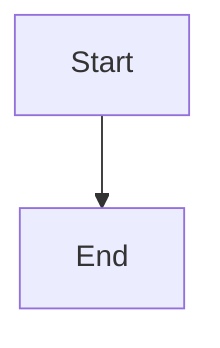

# Quick Start Guide

Get up and running in 5 minutes! ⚡

## Prerequisites

- **Go 1.22+** (for backend)
- **Node.js 18+** (for frontend)
- **Docker** (optional, for containerized deployment)

## Option 1: One-Command Start (Recommended)

```bash
make build && make start
```

That's it! Open http://localhost:33005 and login with `admin` / `changeme`

## Option 2: Shell Script

```bash
./start.sh
```

## Option 3: Docker (Production)

```bash
docker-compose up -d
```

## Option 4: Development Mode

```bash
./dev.sh
```

This runs:
- Backend on http://localhost:33005
- Frontend dev server on http://localhost:5173 (with hot reload)

## First Steps After Login

### 1. Explore the Example Vault
- Click on files in the sidebar
- Try `index.md` to see the welcome page
- Navigate to `notes/getting-started.md`

### 2. Test Wikilinks
- Click on any `[[link]]` in the preview
- Notice how it navigates to that file
- Try the directory link: `[[/projects/]]`

### 3. View the Graph
- Click the graph icon (🕸️) in the header
- See how files and directories are connected
- Blue squares = directories
- Gray circles = files
- Click nodes to navigate

### 4. Edit a File
- Select a file from the sidebar
- Type in the editor (left pane)
- See live preview (right pane)
- Changes auto-save after 1 second

### 5. Try LaTeX
Add this to any file:
```markdown
Inline math: $E = mc^2$

Block math:
$$
\int_0^\infty e^{-x^2} dx = \frac{\sqrt{\pi}}{2}
$$
```

### 6. Try Mermaid
Add this to any file:
````markdown

````

## Create Your Own Notes

### Create a New File
1. Create a markdown file in the `vault/` directory:
```bash
echo "# My First Note" > vault/my-note.md
echo "This is my [[index|first note]]!" >> vault/my-note.md
```

2. Refresh the browser
3. The file appears in the sidebar and graph!

### Link Notes Together
Use wikilink syntax:
```markdown
[[note]]              # Links to note.md
[[folder/note]]       # Links to folder/note.md
[[/projects/]]        # Links to directory
[[note|display text]] # Link with custom text
```

## Common Commands

```bash
# Build everything
make build

# Start server
make start

# Development mode (hot reload)
make dev

# Clean build artifacts
make clean

# Test API
make test-api

# Docker
make docker-build
make docker-up
make docker-down

# Show help
make help
```

## Configuration

### Change Port
```bash
export KB_PORT=3000
./start.sh
```

### Change Credentials
```bash
export KB_AUTH_USER=myuser
export KB_AUTH_PASS=mypassword
./start.sh
```

### Use Different Vault
```bash
export KB_VAULT_PATH=/path/to/my/notes
./start.sh
```

### Use .env File
```bash
cp .env.example .env
# Edit .env with your values
source .env && ./start.sh
```

## Keyboard Shortcuts

### In Editor
- `Ctrl/Cmd + S` - Save (manual)
- `Ctrl/Cmd + F` - Find
- `Ctrl/Cmd + Z` - Undo
- `Ctrl/Cmd + Shift + Z` - Redo

### In App
- Click graph icon - Toggle graph view
- Click eye icon - Toggle preview
- Click sidebar icon - Toggle file tree

## Troubleshooting

### Backend won't start
```bash
# Check if port is in use
lsof -i :33005

# Kill existing process
pkill kb-server

# Rebuild
cd backend && go build -o kb-server
```

### Frontend won't build
```bash
# Clean and rebuild
cd frontend
rm -rf node_modules dist
npm install
npm run build
```

### Can't login
- Default is `admin` / `changeme`
- Check environment variables
- Look for errors in browser console (F12)

### Graph not showing
```bash
# Test API directly
curl -u admin:changeme http://localhost:33005/api/graph

# Should return JSON with nodes and edges
```

### Docker issues
```bash
# Clean rebuild
docker-compose down
docker-compose build --no-cache
docker-compose up -d

# View logs
docker-compose logs -f
```

## Tips & Tricks

### Organize Your Vault
```
vault/
├── daily/           # Daily notes
├── projects/        # Project notes
├── areas/          # Areas of responsibility
├── resources/      # Reference material
└── archive/        # Old notes
```

### Use Directory Links
Create hub pages for directories:
```markdown
# Projects

All my projects: [[/projects/]]

- [[projects/project-a]]
- [[projects/project-b]]
```

### Backlinks
Every file shows what links to it:
```bash
curl -u admin:changeme http://localhost:33005/api/backlinks/index.md
```

### Search Everything
```bash
curl -u admin:changeme "http://localhost:33005/api/search?q=knowledge"
```

## Next Steps

1. **Read FEATURES.md** - Learn about all features
2. **Read TEST.md** - Comprehensive testing guide
3. **Read ARCHITECTURE.md** - Technical deep dive
4. **Customize theme** - Edit `frontend/tailwind.config.js`
5. **Add your notes** - Copy your markdown files to `vault/`
6. **Set up HTTPS** - Use nginx/caddy reverse proxy
7. **Backup** - Regular backups of `vault/` directory

## Resources

- **README.md** - Full documentation
- **FEATURES.md** - Feature overview
- **ARCHITECTURE.md** - Technical details
- **TEST.md** - Testing guide
- **CHANGELOG.md** - Version history

## Support

### Common Questions

**Q: Can I use my existing Obsidian vault?**
A: Yes! Just point `KB_VAULT_PATH` to your vault directory.

**Q: Does it support plugins?**
A: Not yet, but it's on the roadmap.

**Q: Can multiple people use it?**
A: Currently single-user. Multi-user is planned.

**Q: How do I backup?**
A: Just backup the `vault/` directory (it's all markdown files).

**Q: Can I customize the theme?**
A: Yes! Edit `frontend/tailwind.config.js` and rebuild.

**Q: How do I update?**
A: Pull latest code, run `make build`, restart server.

**Q: Is it mobile-friendly?**
A: Basic mobile support. Full mobile optimization coming soon.

## Get Help

1. Check documentation files
2. Look at example vault files
3. Review TEST.md troubleshooting section
4. Check browser console for errors
5. Review server logs

## That's It!

You're ready to build your knowledge graph! 🚀

Start creating markdown files, linking them together, and watching your knowledge base grow.

Happy note-taking! 📝✨
