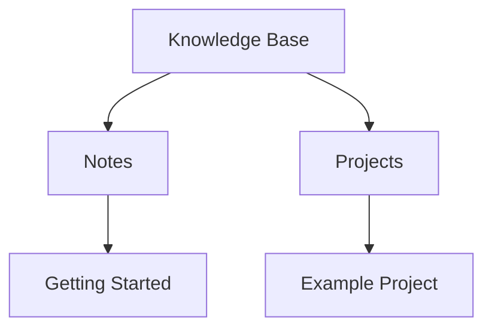

# Welcome to Your Knowledge Base

This is a lightweight, self-hosted knowledge base with support for wikilinks and graph visualization.

## Features

- **Wikilinks**: Link to other notes with `[[note]]` syntax
- **Directory nodes**: Link to folders with `[[/folder/]]`
- **LaTeX support**: Inline math $E = mc^2$ and display math

$$
\int_{-\infty}^{\infty} e^{-x^2} dx = \sqrt{\pi}
$$

- **Mermaid diagrams**: Create flowcharts and diagrams

## Quick Links

- [[notes/getting-started|Getting Started Guide]]
- [[/projects/|Projects Directory]]
- [[notes/syntax-guide|Syntax Guide]]

## Example Diagram

## Navigation

Use the sidebar to browse files, or toggle the graph view to see connections between notes.
