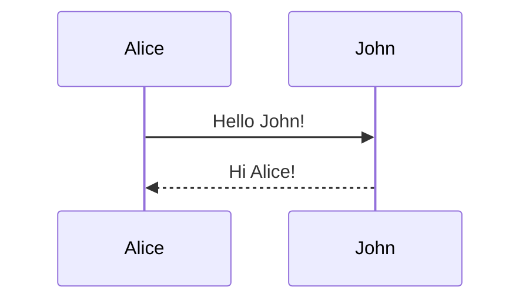

# Syntax Guide

Complete guide to markdown syntax supported in this knowledge base.

## Headers

# H1 Header
## H2 Header
### H3 Header

## Text Formatting

**Bold text** and *italic text*

~~Strikethrough~~

## Lists

Unordered:
- Item 1
- Item 2
  - Nested item

Ordered:
1. First
2. Second
3. Third

## Links

- Regular: [Google](https://google.com)
- Wikilink: [[index]]
- With alias: [[index|Home Page]]
- Directory: [[/projects/]]

## LaTeX

Inline: $\alpha + \beta = \gamma$

Display:

$$
\sum_{i=1}^{n} i = \frac{n(n+1)}{2}
$$

## Mermaid Diagrams



## Tables

| Feature | Supported |
|---------|-----------|
| Markdown | ✓ |
| LaTeX | ✓ |
| Mermaid | ✓ |
| Wikilinks | ✓ |

## Blockquotes

> This is a blockquote
> It can span multiple lines

## Code

Inline `code` and code blocks:

```python
def factorial(n):
    if n <= 1:
        return 1
    return n * factorial(n - 1)
```

## Back to

- [[index|Home]]
- [[notes/getting-started|Getting Started]]
