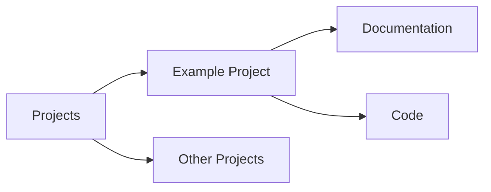

# Example Project

This is an example project demonstrating directory links and organization.

## Overview

This project is part of [[/projects/|the projects directory]].

## Related Notes

- [[index|Back to Home]]
- [[notes/getting-started|Getting Started]]

## Project Structure



## Mathematics

The project uses some interesting math:

$$
\nabla \times \mathbf{E} = -\frac{\partial \mathbf{B}}{\partial t}
$$

## Implementation

```go
func main() {
    fmt.Println("Hello from the knowledge base!")
}
```

## Links

- View all [[/projects/|projects]]
- See [[/notes/|all notes]]
